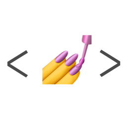
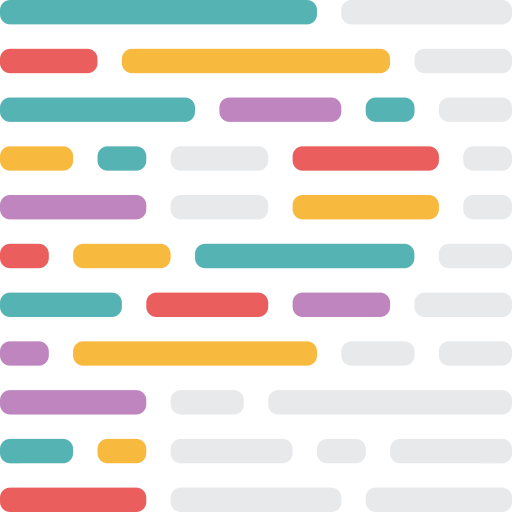
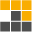
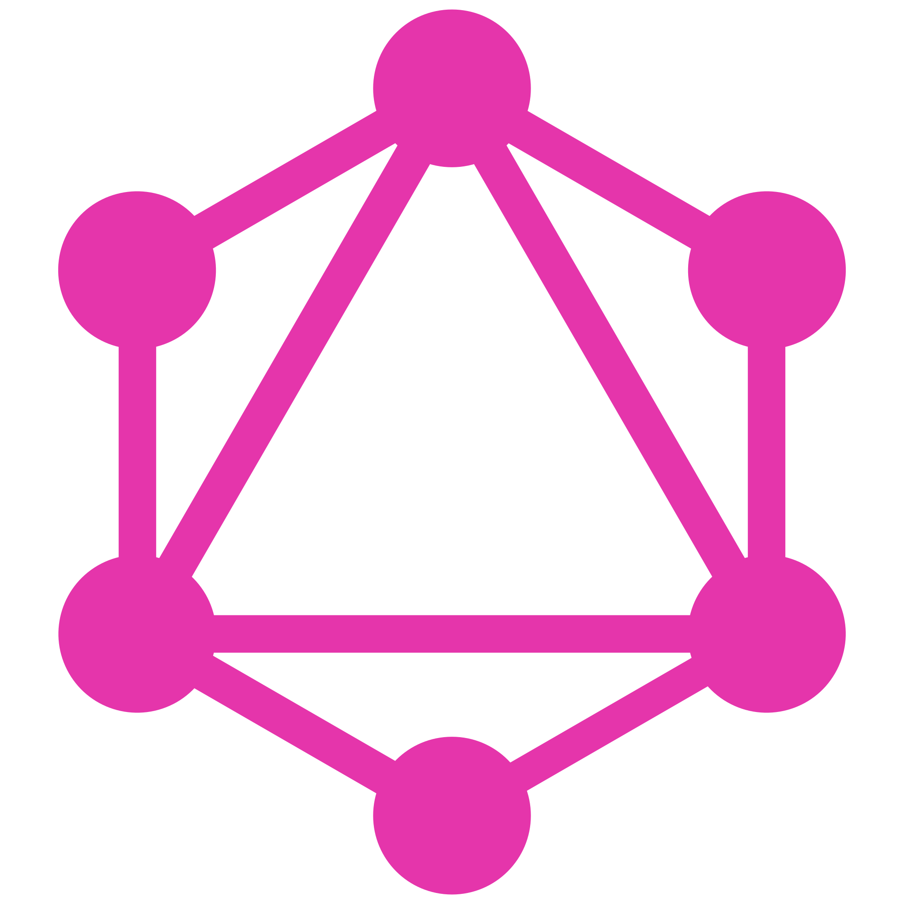

# 👋 Hi there! I'm Marian Pidchashyi

### Frontend Deeloper from Ukraine 💙💛

<h2 align="left">🔥 Tech stack</h2>

> General

<table>
  <tr>
    <td align="center" width="50" height="70">
        
       HTML5
    </td>
    <td align="center" width="50" height="70">
        
       CSS3
    </td>
    <td align="center" width="50" height="70">
        
       JavaScript
    </td>
    <td align="center" width="50" height="70">
        
       TypeScript
    </td>
</table>

> Frontend

<table>
  <tr>
    <td align="center" width="50" height="70">
        
       React
    </td>
    <td align="center" width="50" height="70">
        
       Next.js
    </td>
    <td align="center" width="50" height="70">
        
       Astro
    </td>
        <td align="center" width="75" height="50">
        
       Vite
    </td>
  </tr>
</table>

> Backend

<table>
  <tr>
    <td align="center" width="50" height="50">
        
       Nodejs
    </td>
    <td align="center" width="50" height="50">
        
       Express.js
    </td>
    <td align="center" width="50" height="50">
        
       MongoDB
    </td>
    <td align="center" width="50" height="50">
        
       PostgreSQL
    </td>
     <td align="center" width="50" height="50">
        
       Prisma
    </td>
  </tr>
</table>

> Clouds

<table>
  <tr>
    <td align="center" width="70" height="50">
        
       Vercel
    </td>
    <td align="center" width="70" height="50">
        
       Netlify
    </td>
    <td align="center" width="70" height="50">
        
       Firebase
    </td>
    <td align="center" width="50" height="50">
        
       Supabase
    </td>
  </tr> 
</table>

> Styling and UI LIbraries

<table>
  <tr>
    <td align="center" width="70" height="50">
        
       SASS
    </td>
    <td align="center" width="130" height="50">
        
       Styled components
    </td>
    <td align="center" width="50" height="50">
        
       TailwindCSS
    </td>
    <td align="center" width="50" height="50">
        
       ShadcnUI
    </td>
    <td align="center" width="50" height="50">
        
       MaterialUI
    </td>
    <td align="center" width="50" height="50">
        
       DaisyUI
    </td>
  </tr> 
</table>

> State Management and Other helper libraries

<table>
  <tr>
    <td align="center" width="90" height="90">
        
       Redux Toolkit
    </td>
    <td align="center" width="106" height="90">
        
       Zustand
    </td>
    <td align="center" width="106" height="90">
        
       Tanstack query
    </td>
    <td align="center" width="90" height="90">
        
       React hook form
    </td>
    <td align="center" width="106" height="90">
        
       Zod
    </td>
    <td align="center" width="106" height="90">
        
       React hot toast
    </td>
    </tr>
</table>

> Testing

<table>
  <tr>
    <td align="center" width="70" height="50">
        
       Jest
    </td>
    <td align="center" width="150" height="50">
        
       React Testing LIbrary
    </td>
    
  </tr> 
</table>

> Code quality

<table>
  <tr>
    <td align="center" width="50" height="50">
        
       Eslint
    </td>
    <td align="center" width="50" height="50">
        
       Prettier
    </td>
  </tr> 
</table>

> Devops Tools

<table>
  <tr>
   <td align="center" width="70" height="70">
        
       Linux
    </td>
    <td align="center" width="70" height="70">
        
       Postman
    </td>
   <td align="center" width="70" height="70">
        
       Git
    </td>
    <td align="center" width="70" height="70">
        
       GitHub
    </td>
    <td align="center" width="70" height="70">
        
       NPM
    </td>
    <td align="center" width="70" height="70">
        
       PNPM
    </td>
  </tr>
</table>

> I will learn

<table>
  <tr>
    <td align="center" width="50" height="50">
        
       Storybook
    </td>
    <td align="center" width="50" height="50">
        
       GraphQL
    </td>
    <td align="center" width="50" height="50">
        
       Docker
    </td>
    <td align="center" width="50" height="50">
        
       Nest.js
    </td>
  </tr> 
</table>

## Github Statistics

